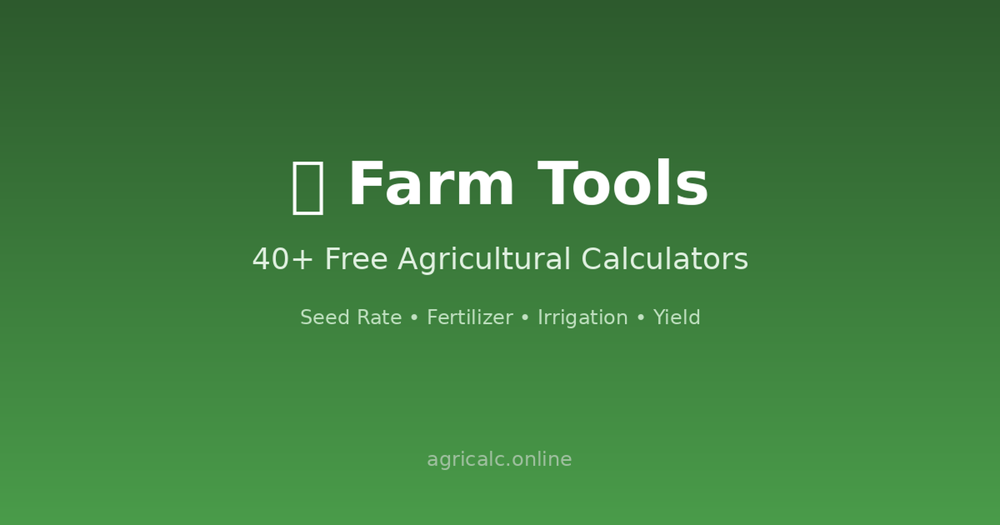

  

<h1 align="center">Agricalc</h1>

  <strong>Free science-based agriculture calculators</strong> — covering the full farming cycle: 
  planting · fertilization · irrigation · harvest · marketing

  

  
  
  
  

## ✨ Features

- 🧪 **Science-based** — every calculator built on established agricultural formulas and reference data
- 📖 **53-term glossary** — CEC, GDD, evapotranspiration, N-P-K…
- 📴 **Works offline** — full PWA, designed for fields with poor connectivity
- 🌍 **Multi-language**, 📱 **mobile-friendly**
- 🔓 **No registration** — free forever

## 🧮 Calculators

130+ free calculators & converters across the farming cycle:

| Stage | Examples |
|---|---|
| 🌱 Planting | seed rate, germination |
| 🧪 Fertilization | NPK / banana fertilizer planners |
| 💧 Irrigation | scheduling, water requirements |
| 🌾 Harvest & Yield | yield estimation, bale count |
| 🐄 Livestock | feed rations, calving dates |
| 🐟 Aquaculture & Beekeeping | stocking density, honey yield |
| 💰 Farm Finance | loans, subsidies, break-even price & yield |
| 📐 Converters | area, bulk density, units |

👉 **[Try them all at agricalc.online](https://agricalc.online)**

## 🛠️ Tech

Pure static site — HTML/CSS/JS, no backend, no build step. PWA via service worker (`sw.js`). Deploy anywhere (currently served with Caddy).

## 💬 Feedback

Found a formula that doesn't match your practice? Missing a calculator? [Open an issue](https://github.com/liulewis/agricalc/issues) — especially welcome from farmers & agronomists.

---

⭐ If Agricalc helps you, a Star is the best thanks!
